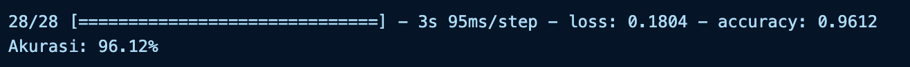
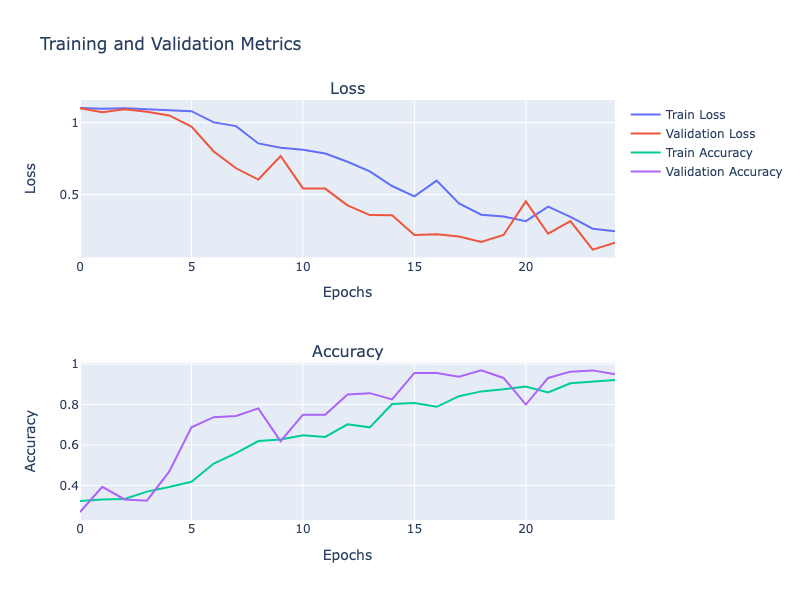

# Rock, Paper, Scissors Classifier

### Author: M. Ilhaam Ghiffari
### NPM: 2108107010005
### Email: [ilham211@mhs.usk.ac.id](mailto:ilham211@mhs.usk.ac.id)

[](https://colab.research.google.com/drive/1SNkh-SLwQdWs2OPbW3wEsKo4hQ5mD61k?usp=sharing)

## Project Overview
This project is focused on building and training a deep learning model to classify images of hand gestures representing rock, paper, or scissors. The project utilizes a dataset available on Kaggle, which consists of images of hands in various positions corresponding to the rock, paper, or scissors gestures.

## Dataset
The dataset used in this project is the [Rock-Paper-Scissors Dataset](https://www.kaggle.com/datasets/drgfreeman/rockpaperscissors) available on Kaggle. It includes a large collection of images (around 2,900) segmented into three categories: rock, paper, and scissors. Each category contains images of hands in positions representing the respective gesture. The dataset is well-balanced, ensuring equal representation for each category, which is crucial for training an unbiased model.

## Installation
To run this project, you need to download the dataset and set up the environment:
```bash
!wget --no-check-certificate \
    https://github.com/dicodingacademy/assets/releases/download/release/rockpaperscissors.zip \
    -O /tmp/rockpaperscissors.zip
```

## Data Preparation
The dataset is downloaded, extracted, and divided into training and validation sets

## Model Architecture
The model is a convolutional neural network (CNN) with multiple layers, including Conv2D, MaxPooling2D, GlobalAveragePooling2D, and Dense layers.

## Training the Model
The model is trained using callbacks like EarlyStopping, ModelCheckpoint, ReduceLROnPlateau, and TensorBoard to optimize performance and prevent overfitting.

## Evaluation and Visualization
The model's performance is evaluated and visualized using Plotly. Graphs for loss and accuracy are plotted to understand the training and validation metrics over epochs.


## Accuracy

The accuracy of this model is **96.12%**

## Training graphs


## Tensorboard
TensorBoard logs, useful for detailed performance analysis, available under the **content** folder.

Screenshots of Tensorboard also inculded in the **Tensorboard_Image** folder


